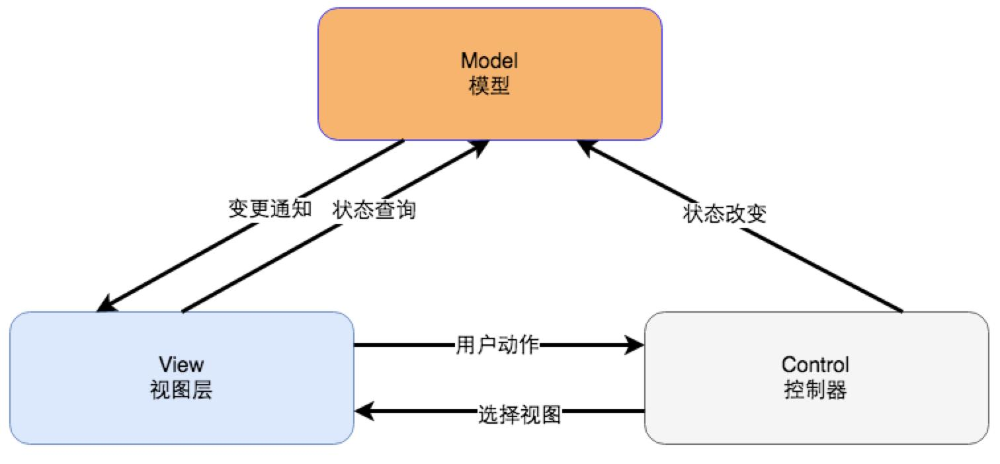
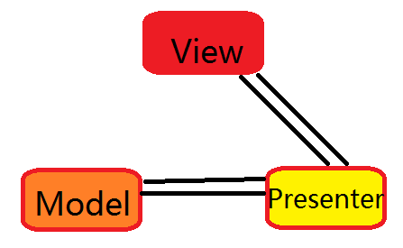
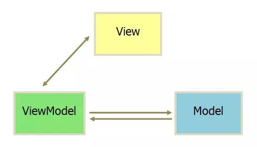
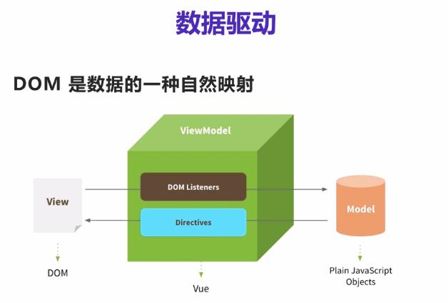

# vue.js_notes

《Vue.js 从入门到实战》笔记

# 第 1 章 Vue.js 概述

## 1.1 Web 前端技术发展

MVC  
JSP  
PHP  
Ajax(Asynchronous JavaScript and XML)  
Asynchronous JavaScript+CSS+DOM+XMLHttpRequest  
[Ajax: A New Approach to Web Applications(译文)](http://www.360doc.com/content/05/0714/14/332_1689.shtml)  
<https://www.cnblogs.com/arlen/articles/362325.html>

    Ajax 并不是一种新技术，它实际上是几种已经在各自领域大行其道的技术的强强结合。Ajax具体的组成部分如下：
    基于标准化的 XHTML 和 CSS
    * 通过DOM(Document Object Model) 实现动态显示和交互;
    * 通过 XML 和 XSLT 来进行数据交换和处理;
    * 使用 XMLHttpRequest 通过异步方式获取数据;
    * 使用 Javascript 来整合以上所有的技术

JQuery  
Angular、React、Vue  
SPA(Single page appplication，单页应用程序)

- 优点
  - 前后端分离
  - 良好的用户体验
  - 减轻服务器压力
  - 共用一套后端程序代码
- 缺点
  - 初次加载耗时多
  - 前进、后退问题
  - SEO 难度高

### 前端技术体系

- 代码仓库管理：github
- 包管理工具：NPM、Yarn
- 脚本体系：ECMAScript6、TypeScript、Babel
- HTML5、CSS3 和响应技术
- 前端框架：React、Vue、Augular
- 打包工具：Webpack
- 后端框架：Node.js 为基础的 Express 和 Koa

## 1.2 MV\*框架

### 1.2.1 MVC

- 模型：应用程序的数据、用于访问控制和修改这些数据的业务规则
- 视图：组织模型的内容
- 控制器：应用程序的行为



### 1.2.2 MVP

- MVP(Model-View-Presenter)
  - Presenter 负责逻辑处理
  - Model 提供数据
  - View 负责显示



### 1.2.3 MVVM

- MVVM(Model-View-ViewModel)
- 核心是数据驱动 ViewModel，数据双向绑定
- View 和 Model 之间存在 ViewModel 这个中介充当观察者角色
- 通过声明式数据绑定实现 View 的分离，完全解耦 View



## 1.3 初识 Vue.js



- DOM Listeners：监听 DOM 元素变化
- Data Bindings：更新页面中的 DOM 元素

# 第 2 章 开发准备开发与调试环境

## 2.1 安装 Vue.js

- 独立版本
- CDN
- NPM

```
# 安装最新版npm
npm install npm@latest -g

# 安装vue
# 本地安装
npm install vue
npm i vue

# 安装到的目录 ./npm_modules
无法被其他路径项下项目引用

# 全局安装
npm install vue -g

1. 新建：
c:\nodejs_package
c:\nodejs_package\npm_modules
c:\nodejs_package\npm_cache

2. 修改环境变量NODE_PATH=c:\nodejs_package\npm_modules


# 查看全局安装包
npm list -g --depth 0

npm update vue -g
npm uninstall vue -g

# 淘宝npm镜像

npm install -g cnpm --registry=https://registry.npm.taobao.org

```

# 第 3 章 ECMAScript6 语法简介

## 3.1 块作用域构造 let 和 const

- 块级声明用于声明在指定块的作用域之外无法访问的变量
  - 函数内部
  - 块中 {}

### 3.1.1 let 声明

- JavaScript 变量提升机制：
- let 声明变量不会被提升

### 3.1.2 const 声明

- const 声明的常量必须在声明时初始化
- const 声明对象，对象本身的绑定不能修改，对象的属性值可以修改

### 3.1.3 全局块作用域绑定

- 全局作用域中使用 var 声明变量或对象，将作为浏览器环境中的 window 对象属性，var 很可能会无意中覆盖一个已经存在的全局属性。
- 在全局作用域下使用 let 或 const，创建一个新的绑定，不能称为 window 对象的属性。

## 3.2 模板字面量

- 多行字符串 ``
- 字符串占位符 ${变量}

## 3.3 默认参数

## 3.4 rest 参数

- JS 中无论函数定义中声明了多少个形参，都可以传入任意数量的参数，在函数内部可以通风 arguments 对象来接收传入的参数
- 函数的命名参数前加...  
  function calculate(op, ...data)
- 每个函数最多只能声明一次，只能是最后一个参数

## 3.5 展开运算符

## 3.6 对象字面量语法扩展

### 3.6.1 属性初始值简写

### 3.6.2 对象方法的简写语法

### 3.6.3 可计算的属性名

## 3.7 解构赋值

### 3.7.1 对象解构

### 3.7.2 数组解构

## 3.8 箭头函数

### 3.8.1 箭头函数语法(类似 Java 中 lamba 表达式)

```javascript

```

### 3.8.2 箭头函数与 this

- JavaScript 中 this 并不是指向对象本身，其指向根据当前执行上下文的变化而变化。
- 使用函数对象的 bind()方法，将 this 明确绑定到某个对象上。

## 3.9 类

- JavaScript 不支持类和类继承，只能通过其他方式模拟：构造函数 + 原型，ECMAScript6 引入 class 的概念

### 3.9.1 定义类

```javascript
// ECMAScript6之前通过构造函数和原型混合使用模拟定义类
function Car(sColor, iDoors) {
  this.color = sColor;
  this.doors = iDoors;
}

Car.prototype.showColor = function () {
  console.log(this.color);
};

var oCar = new Car("red", 4);
oCar.showColor();

// ECMAScript6
class Car {
  // 等价于Car构造函数
  constructor(sColor, iDoors) {
    this.color = sColor;
    this.doors = iDoors;
  }

  // 等价于Car.prototype.showColor
  showColor() {
    console.log(this.color);
  }
}

var oCar = new Car("red", 4);
oCar.showColor();

// 创建了一个单例对象
let car = new (class {
  //定义
})();
```

### 3.9.2 访问器属性

```javascript
class Car {
  constructor(sName, iDoors) {
    // _name前下划线是约定记号，表示只能通过对象方法访问属性
    this._name = sName;
    this.doors = iDoors;
  }

  // 只读属性
  get desc() {
    return `${this.name} is worth having`; // this.name是对象方法
  }

  get name() {
    return this._name;
  }

  set name(value) {
    this._name = value;
  }
}

let car = new Car("benz", 4);
console.log(car.name);
console.log(car._name);
console.log(car.desc);
```

### 3.9.3 静态方法（没有静态属性）

- 只能通过类名调用静态方法

### 3.9.4 类的继承

- 派生类定义了构造函数，则必须调用 super()，而且一定要在范围 this 之前调用

```javascript
class Person {
  constructor(name) {
    this.name = name;
  }

  work() {
    console.log("working...");
  }
}

class Teacher extends Person {
  //没有构造函数
}
//等价于
/*class Teacher extends Person{
	constructor(...args){
		super(...args);
	}
}*/
```

## 3.10 模块

- 一个模块通常是一个独立的 JS 文件，该文件内部定义的变量和函数除非被导出，否则不能被外部所访问。
- 变量、函数、类声明
- 导出
  - expert xx as xxx
- 导入
  - import xx from xxx

## 3.11 promise

- JS 引擎基于单线程时间循环的概念构建，采用任务队列的方式，将要执行的代码放到队列中。
- JS 执行异步调用的传统方式：时间、回调，
  更强大的异步解决方案：promise

```javascript
const promise = new Promise(function (resolve, reject) {
  // 开启异步操作
  setTimeout(function () {
    try {
      let c = 6 / 0;
      console.log(c);
      resolve(c); // 执行成功调用resolve函数
    } catch (error) {
      console.log("error");
      reject(error); // 执行失败调用reject函数
    }
  }, 1000);
});
```

- 生命周期
  - pending -> fullfilled
  - pending -> rejected

```javascript
const promise = new Promise(function (resolve, reject) {
  // 开启异步操作
  setTimeout(function () {
    try {
      let c = 6 / 0;
      console.log(c);
      resolve(c); // 执行成功调用resolve函数
    } catch (error) {
      console.log("error");
      reject(error); // 执行失败调用reject函数
    }
  }, 1000);
});

promise.then(
  function (value) {
    // 完成
    console.log(value);
  },
  function (err) {
    // 拒绝
    console.log(err.message);
  }
);

promise
  .then(function (value) {
    // 完成
    console.log(value);
  })
  .catch(function (err) {
    // 拒绝
    console.log(err.message);
  });
```

- promise 方法链
  - 每次调用 then()或者 catch()方法时，方法实际上会创建并返回另一个 promise，因此可以将 promise 串联调用
  - promise 链式调用可以给后续的 promise 传递数据，只需要在完成处理函数中指定一个返回值。
  - 如果没有使用 catch()方法指定错误处理的回调函数，那么 promise 对象抛出的错误不会传递到外层代码，即不会有任何反应。

# 第 4 章 Vue.js 语法简介

## 4.1 Vue 实例

```js
var vm = new Vue({});
```

## 4.2 插值

- {{}}

## 4.3 指令

- 指令是带有 v-前缀的特殊属性，值限定为单个表达式，作用是当表达式值发生改变时，将这个变化反映到 DOM 上。
- v-bind：响应式更新 HTML 属性
  - 动态参数\<a v-bind:[attributename]="url"> 新浪网\</a>
- v-on：监听 DOM 事件

# 第 5 章 指令

## 5.1 内置指令

- v-show
  - 通过设置 css 属性控制是否显示元素：style="display:none;"
- v-if/v-else-if/v-else

  - v-if = false：不会创建元素
  - v-if-key：key 值不同，输入框会重新渲染，切换后原先的输入清空

- v-for

  - 数组变异方法（mutation method）

    - push()
    - pop()
    - shift()
    - unshift()
    - splice()
    - sort()
    - reverse()

  - 数组非变异方法（non-mutation method）,返回新数组
    - fiter()
    - concat()
    - slice()

_Array 对象方法_

| 方法             | 描述                                                           |
| ---------------- | -------------------------------------------------------------- |
| concat()         | 连接两个或更多的数组，并返回结果。                             |
| join()           | 把数组的所有元素放入一个字符串。元素通过指定的分隔符进行分隔。 |
| pop()            | 删除并返回数组的最后一个元素                                   |
| push()           | 向数组的末尾添加一个或更多元素，并返回新的长度。               |
| reverse()        | 颠倒数组中元素的顺序。                                         |
| shift()          | 删除并返回数组的第一个元素                                     |
| slice()          | 从某个已有的数组返回选定的元素                                 |
| sort()           | 对数组的元素进行排序                                           |
| splice()         | 删除元素，并向数组添加新元素。                                 |
| toSource()       | 返回该对象的源代码。                                           |
| toString()       | 把数组转换为字符串，并返回结果。                               |
| toLocaleString() | 把数组转换为本地数组，并返回结果。                             |
| unshift()        | 向数组的开头添加一个或更多元素，并返回新的长度。               |
| valueOf()        | 返回数组对象的原始值                                           |

1. v-for 遍历数组
2. 数组更新检测
3. 过滤与排序
4. 遍历整数
5. 遍历对象
6. 对象更新检测

   - Vue 不能检测对象属性的添加和删除。解决方法:

     - Vue 全局 set()和 delete()方法
     - 实例的$set()和 delete()方法

     ```javascript
     Vue.set(vm.book, "publishDate", "2019-06-01");
     vm.$set(vm.book, "publishDate", "2019-06-01");

     Vue.delete(vm.book, "isbn");
     vm.$delete(vm.book, "isbn");
     ```

7. 在\<template>上使用 v-for
8. key 属性

- v-bind
  - 将一个或多个属性或者一个组件的 prop 动态绑定到表达式
- v-model

  - v-model 指令用来在表单\<input>、\<textarea>、\<select>元素上创建双向数据绑定
  - 本质上是语法糖，它负责监听用户输入事件以更新数据

  ```js
    <div id="app">
      <input type="text" v-model="message" />
      <h1>{{message}}</h1>
    </div>

    <script>
      var vm = new Vue({
          el:"#app",
          data:{
            message:"hello world"
          },
      });
    </script>
  ```

- v-on

  - v-on 指令用于监听 DOM 事件，并在触发时运行一些 JS 代码。
  - 表达式可以是一段 js 代码，一个方法名字、方法调用语句

  1. 事件修饰符

     - .stop：调用 event.stopPropagation()
     - .prevent：调用 event.stopPreventDefault()
     - .capture：添加事件监听器 capture 模式
     - .self：只当事件是从监听器绑定的元素本身触发时才触发回调
     - .{keyCode | keyAlias}
     - .navtive：监听组件根元素的原生事件
     - .once
     - .left 鼠标左键
     - .right
     - .middle
     - .passive

     JavaScript 的 DOM 事件模型

     - 捕获型和冒泡型

  2. 按键修饰符

     - .enter
     - .tab

  3. .exact 修饰符
  4. 鼠标按键修饰符

- v-text
  - 更新元素文本内容
- v-html
  - 更新元素的 innerHTML
- v-once
  - 让元素或组件只渲染一次
  - 该指令不需要表达式
- v-pre
  - 跳过这个元素和它子元素的编译过程
  - 用来显示元素{{}}标签
- v-cloak

  - 隐藏未编译的{{}}标签直到实例准备完毕

  ```js
    <head>
      <style>
        [v-cloak] {
          display: none;
        }
      </style>
    </head>

    <body>
      <div id="app">
        <h1 v-cloak>{{message}}</h1>
      </div>

      <script>
        var vm = new Vue({
          el: "#app",
          data: {
            message: "Vue.js",
          },
        });
      </script>
    </body>
  ```

- v-slot
  - 提供命名的插槽或需要接收 prop 的插槽

## 5.2 自定义指令

### 5.2.1 自定义指令的注册

- 全局注册
  - Vue.directive(id, [definition])
- 局部注册
  - 只能用在该实例绑定的视图中

### 5.2.2 钩子函数

- bind
- inserted
- update
- componentUpdate
- unbind

#### 指令钩子函数的参数

- el
- binding

### 5.2.3 动态指令参数

### 5.2.4 函数简写

### 5.2.5 对象字面量

## 5.3 实例

# 第 6 章 计算属性

## 6.1 定义计算属性

## 6.2 计算属性缓存

## 6.3 v-for 和 v-if 一起使用的替代方案

# 第 7 章 监听器

## 7.1 使用监听器

## 7.2 监听器的更多形式

# 第 8 章 class 与 style 绑定

## 8.1 绑定 HTML class

- v-bind:class

### 8.1.1 对象语法

### 8.1.2 数组语法

### 8.1.3 在组件上使用

## 8.2 绑定内联样式

- v-bind:style

### 8.2.1 对象语法

### 8.2.2 数组语法

### 8.2.3 自动添加前缀

### 8.2.4 多重值

# 第 9 章 表单输入绑定

## 9.1 单行文本输入

- v-model
  - v-model 会忽略所有表单元素的 value、checked、selected 属性的初始值，总是将 Vue 实例的数据属性作为数据来源。
  - .trim
  - .lazy
  - .number

## 9.2 多行文本输入

## 9.3 复选框

## 9.4 单选按钮

## 9.5 选择框

## 9.6 值绑定

### 9.6.1 复选框

### 9.6.2 单选按钮

### 9.6.3 选择框的选项

## 9.7 实例：用户注册

# 第 10 章 过滤器

- 过滤器主要用于文本格式化，数组数据过滤和排序
- 本质是一个 js 函数，与自定义指令类似

## 10.1 全局过滤器与局部过滤器

- 全局
  ```js
  Vue.filter(id, [definition]);
  ```
- 局部

  ```js
  new Vue({
    filters: id : function (value) {},
  });
  ```

- 过滤器用在两个地方：差值，v-bind 表达式，支持|管道

## 10.2 过滤器参数

- 总是接收表达式的值作为第一个参数

## 10.3 过滤器串联

# 第 11 章 组件

# 第 12 章 虚拟 DOM 和 render 函数


# 第 14 章 使用 Vue Router 开发单页应用

## 14.1 前端路由
